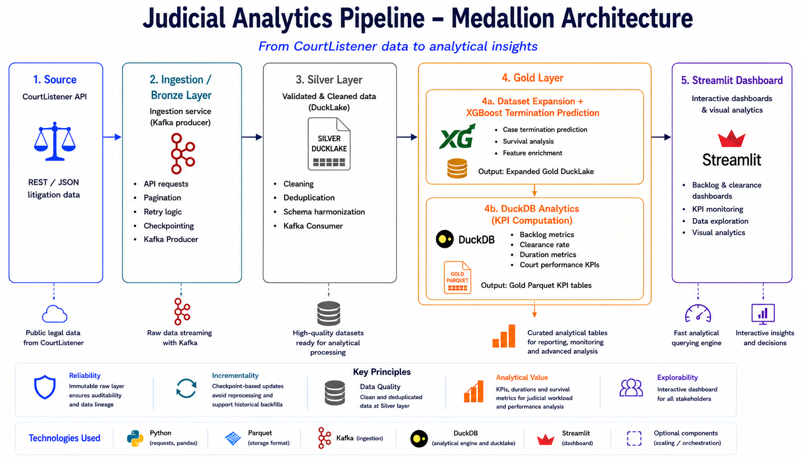
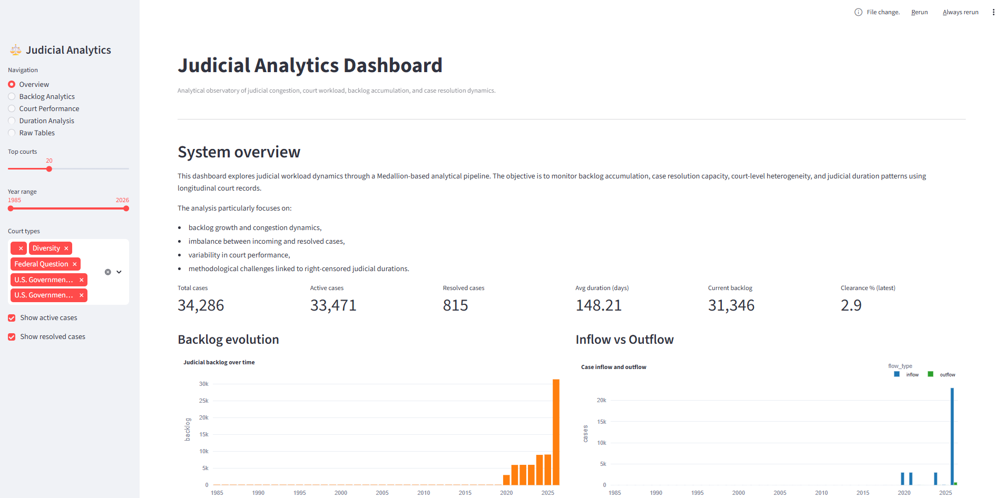

# CourtListener Judicial Analytics Dashboard

Interactive judicial analytics project exploring court activity, backlog dynamics, and judicial performance indicators using CourtListener litigation data.

The project combines Medallion Architecture pipelines, parquet analytical layers, DuckDB processing, analytical visualizations, and an interactive Streamlit dashboard.

---

## Architecture



End-to-end Medallion-inspired analytical pipeline for judicial data ingestion, transformation, and KPI generation.

---

## Courtlistener Access

Go to https://www.courtlistener.com/ and register (upper-right corner of the page). Insert your information and follow the account confirmation procedure. Once done and logged in, go to the upper-right corner of the page, under "Profile", click "Account", then "Developer Tools" and "Your API Token". Fallback: https://www.courtlistener.com/profile/api-token/. Copy the token, open the repository and paste the token in the ".env" file, next to "COURTLISTENER_TOKEN", in place of "paste_here_your_token".

## How to run it

Requirements:

- having Docker installed and running,

- having a python 3.12 environment activated and selected as interpreter,

- having a Courtlistener personal token to access the API and having it stored in ".env" under "COURTLISTENER_TOKEN".

To test the program to its full potential, we recommend running in order the following programs:

- open "https://drive.google.com/drive/folders/1-pogtrR4fofkjftPa86cw_hEXPVQ0G4G?usp=sharing", download "database_dockets_latest.zip", unzip it and store it in the folder "silver/": it represents our database,

- install the packages in 'requirements.txt' (pip install -r requirements.txt),

- run_kafka.py : for your first use, answer "n" both to "Has the docker container already been configured? (y/n): " and to "Has the database ducklake been already set up? (y/n): ". It will fetch data from Courtlistener, send it to the Bronze topic and process it through the Silver layer, it will run until you stop it,

- run_gold_pipeline.py: it will combine the new data with our existing database and compute the gold metrics that will be used for the dashboard. If you experience memory problems, try set "STOP_KAFKA_STACK_DURING_RUN = True". For larger containers, you can execute the entire file within the container. Set "LARGE_CONTAINER = True",

- run fetch_case.py: it will return the name and data for a number of closed and open cases to test the interactive query dashboard page,

- dashboard.py : don't run it directly, write in the terminal ```bash python -m streamlit run "./dashboard.py"```. In case it doesn't work, use the absolute path to the script. It will launch a dashboard with the most important metrics for cases backlogs.

---

## Dashboard preview



Interactive Streamlit dashboard for backlog monitoring, court performance analysis, clearance-rate exploration, and judicial duration analytics.

---

## Presentation

Full presentation available in:

[BDT Project Presentation](docs/presentation/BDT_project_presentation.pdf)

---

## Project objectives

This project investigates judicial workload and court congestion dynamics through exploratory analytical metrics derived from CourtListener public litigation records.

The analysis focuses on:
- judicial backlog evolution,
- case inflow and outflow dynamics,
- clearance rate estimation,
- court-level workload disparities,
- case duration distributions,
- exploratory judicial performance indicators.

The project aims to:
- build a reproducible judicial analytics pipeline,
- implement a Medallion Architecture workflow,
- generate analytical parquet datasets,
- support exploratory court performance analysis,
- provide an interactive dashboard for visual analytics.

---

## Medallion Architecture

The project follows a layered analytical architecture:

```text
CourtListener API
        ↓
Bronze Layer
(raw ingestion using Kafka Producer)
        ↓
Silver Layer
(Consumer receives, cleans and stores docket datasets into Silver Lake)
        ↓
Gold Pipelines
(Case enhancement in Gold Lake, then KPI generation)
        ↓
Gold Metrics
(analytical parquet tables)
        ↓
DuckDB + Streamlit Dashboard
```

The architecture separates:
- raw ingestion,
- cleaned datasets,
- analytical metrics,
- dashboard serving and visualization layers.

---

## Current dataset status

Current exploratory dataset:

- ~5M judicial records
- Filing date coverage: 1934–2026 (strongly concentrated after 2020)
- Active cases: ~3M
- Average observed duration: ~332 days
- Incremental checkpoint-based ingestion

The dataset remains exploratory and partially incomplete due to API coverage limitations, hardware limitations and right-censoring effects.

---

## Methodological overview

The analytical pipeline combines:
- CourtListener litigation data,
- parquet-based storage layers,
- DuckDB analytical processing,
- Streamlit interactive visualization.

The project remains exploratory and observational:
- no causal inference is claimed,
- judicial coverage remains incomplete,
- terminated case coverage remains limited,
- several metrics remain sensitive to right-censoring effects.

The current dataset exhibits:
- strong imbalance between active and resolved cases,
- backlog accumulation,
- heterogeneous court activity levels,
- sparse duration observations.

---

## Project structure

```text
project/
│
├── data/
│
├── docs/
│   ├── images/
│   │   ├── architecture_project.png
│   │   └── dashboard_preview.png
│   └── presentation/
│       └── BDT_Project_Presentation.pptx
│
├── gold/
│   ├── metrics/
│   │   ├── active_cases_by_circuit_quarter.parquet
│   │   ├── active_cases_by_circuit_year.parquet
│   │   ├── active_cases_by_court_quarter.parquet
│   │   ├── active_cases_by_court_year.parquet
│   │   ├── avg_resolution_time_by_court.parquet
│   │   ├── backlog_evolution_circuit_by_quarter.parquet
│   │   ├── case_duration_distribution_circuit_by_quarter.parquet
│   │   ├── case_duration_distribution_court_by_quarter.parquet
│   │   ├── case_enhanced.parquet
│   │   ├── case_inflow_by_quarter.parquet
│   │   ├── case_inflow_by_year.parquet
│   │   ├── case_outflow_by_quarter.parquet
│   │   ├── case_outflow_by_year.parquet
│   │   ├── court_backlog_evolution.parquet
│   │   ├── current_active_cases_by_court.parquet
│   │   ├── jurisdiction_backlog_evolution.parquet
│   │   └── metrics_by_circuit.parquet
│   │
│   └── pipelines/
│       ├── _common.py
│       ├── build_circuit_backlog.py
│       ├── build_court_backlog.py
│       ├── build_duration_metrics.py
│       ├── build_enhanced_cases.py
│       ├── build_juris_backlog.py
│       ├── build_longitudinal_analysis.py
│       ├── build_metrics.py
│       └── build_temporal_metrics.py
│
├── ingestion/
│   ├── api_client.py
│   ├── checkpoint.py
│   ├── config.py
│   ├── kafkaProducer.py
│   └── open_bulk.py
│
├── logs/
│   ├── checkpoint.json
│   ├── ingestion_history.csv
│   ├── last_update.json
│   └── seen_ids.json
│
├── model_training/
│   ├── court_stats.parquet
|   ├── survival_features_importance.png
|   ├── survival_model.ubj
|   ├── survival_pred_distribution.png
|   ├── survival_pred_vs_actual.png
│   └── training.py
│
│
├── processing/
|   ├── database_migration.py
│   ├── kafkaToSilver.py
│   ├── process_bulk.py
│   └── process_courts.py
│
├── silver/
│   ├── courts/
│   |    └── courts_classified.parquet
│   └── database_dockets_latest.zip
│
├── .dockerignore
├── .env
├── .gitignore
├── compose.yaml
├── dashboard.py
├── Dockerfile
├── fetch_some.py
├── README.md
├── requirements.txt
├── run_gold_pipeline.py
└── run_kafka.py
```

---

## Analytical workflow

### 01 — Data ingestion

- CourtListener API requests
- paginated ingestion,
- raw docket collection,
- Kafka Producer sending raw dockets to the bronze topic


### 02 — Silver processing

- Kafka Consumer reception of raw dockets
- docket cleaning,
- schema harmonisation,
- temporal normalization,
- cleaned parquets generation.

### 03 — Gold analytical pipelines

- case metrics construction,
- inflow and outflow aggregation,
- backlog computation,
- clearance rate estimation,
- duration analytics,
- court-level KPI generation.

### 04 — Dashboard analytics

- judicial KPI overview,
- backlog evolution visualization,
- court congestion computing,
- duration distribution analysis,
- interactive KPI exploration.

---

## Gold analytical metrics

The Gold layer generates several analytical KPI datasets.

### Judicial backlog

The backlog metric is estimated as cumulative inflow minus cumulative outflow over time.

```text
Backlog(t) =
Σ Inflow(i) − Σ Outflow(i)
for i ≤ t
```

### Clearance rate

The clearance rate is defined as:

```text
CR(t) = Outflow(t) / Inflow(t)
```
### Clearance efficiency 

```text
CR(t) = Outflow(t) / Backlog(t)
```

### Case duration

Case duration is computed as the time difference between filing and termination dates.

```text
Duration = date_terminated − date_filed
```

---

## Streamlit Dashboard Features

The interactive dashboard includes:

- judicial KPI overview,
- backlog evolution analytics,
- inflow vs outflow visualization,
- court congestion rankings,
- case duration distributions,
- clearance rate analysis,
- interactive parquet table exploration.

---

### Incremental ingestion update

```bash
python run_kafka.py
```
---

### Rebuild analytical layers

```bash

python run_gold_pipeline.py
```

---

### Clone the Repository

```bash
git clone https://github.com/Big-data-court-hearings/project.git
cd project
```

### Install Dependencies

```bash
pip install -r requirements.txt
```

### Launch the Dashboard

```bash
python -m streamlit run dashboard.py
```

---

## Docker

### Build container

Windows:
```bash
docker-compose up --build -d
```
Linux:
```bash
docker compose up --build -d
```

### Run container

```bash
docker-compose up -d
```

### Access dashboard

```text
http://localhost:8501
```

## Main analytical observations

Current exploratory findings include:

- strong imbalance between active and resolved cases,
- significant backlog accumulation,
- low observed clearance rates in recent years,
- heterogeneous court-level duration patterns,
- sparse termination observations across jurisdictions.

The current analytical results should be interpreted cautiously due to:
- exploratory dataset size,
- incomplete temporal coverage,
- strong right-censoring effects.

Additional limitations include:

- incomplete historical coverage,
- heterogeneous court representation,
- temporal imbalance toward recent active cases,
- sparse termination observations,
- API/network instability during large historical ingestion runs.

---

## Scalability and engineering design

The platform was designed to support scalable judicial analytics workflows.

Implemented engineering features include:

- incremental ingestion,
- checkpoint-based updates,
- parquet analytical layers,
- DuckDB analytical querying,
- modular Gold KPI pipelines,
- interactive Streamlit analytics.

The architecture separates ingestion, cleaning, analytical computation, and visualization layers in order to improve reproducibility and extensibility.

---

## Future work

Potential future improvements include:

- larger-scale historical ingestion,
- automated scheduled incremental updates,
- advanced backlog forecasting,
- court clustering and anomaly detection,
- additional judicial workload and resolution indicators,
- deployment on cloud analytical infrastructure.

---

## Technologies Used

- Python
- pandas
- DuckDB
- Plotly
- Streamlit
- parquet
- Jupyter Notebook
- Kafka

---

## GitHub Repository

https://github.com/Big-data-court-hearings/project.git

---

## Team And Collaboration

The project was developed collaboratively as part of the Big Data Technologies course at the University of Trento.

Main collaborative activities included:
- judicial analytics pipeline design,
- CourtListener ingestion architecture,
- analytical KPI generation,
- dashboard development,
- project documentation and presentation.

## Authors

Asia Panizza  
MSc Data Science — University of Trento

Yasmin El Morady  
MSc Data Science — University of Trento

Henri Vasserot  
MSc Data Science — University of Trento
