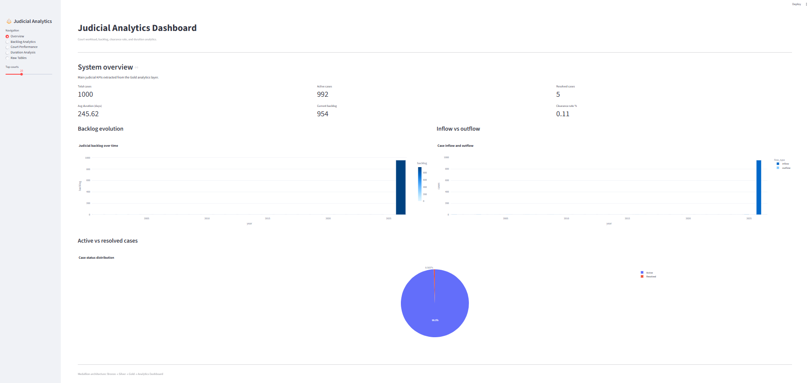

# CourtListener Judicial Analytics Dashboard

Interactive judicial analytics project exploring court activity, backlog dynamics, and judicial performance indicators using CourtListener litigation data.

The project combines Medallion Architecture pipelines, parquet analytical layers, DuckDB processing, publication-style visualizations, and an interactive Streamlit dashboard.

---

## Dashboard preview



Full presentation available in:

[BDT Project Presentation](docs/presentation/BDT_Project_Presentation.pptx)

---

## Project objectives

This project investigates judicial workload and court congestion dynamics through exploratory analytical metrics derived from CourtListener public litigation records.

The analysis focuses on:
- judicial backlog evolution,
- case inflow and outflow dynamics,
- clearance rate estimation,
- court-level workload disparities,
- case duration distributions,
- exploratory judicial performance indicators.

The project aims to:
- build a reproducible judicial analytics pipeline,
- implement a Medallion Architecture workflow,
- generate analytical parquet datasets,
- support exploratory court performance analysis,
- provide an interactive dashboard for visual analytics.

---

## Medallion Architecture

The project follows a layered analytical architecture:

```text
CourtListener API
        ↓
Bronze Layer
(raw ingestion)
        ↓
Silver Layer
(cleaned docket datasets)
        ↓
Gold Pipelines
(KPI generation)
        ↓
Gold Metrics
(analytical parquet tables)
        ↓
DuckDB + Streamlit Dashboard
```

The architecture separates:
- raw ingestion,
- cleaned datasets,
- analytical metrics,
- dashboard serving and visualization layers.

---

## Methodological overview

The analytical pipeline combines:
- CourtListener litigation data,
- parquet-based storage layers,
- DuckDB analytical processing,
- Streamlit interactive visualization.

The project remains exploratory and observational:
- no causal inference is claimed,
- judicial coverage remains incomplete,
- terminated case coverage remains limited,
- several metrics remain sensitive to right-censoring effects.

The current dataset exhibits:
- strong imbalance between active and resolved cases,
- backlog accumulation,
- heterogeneous court activity levels,
- sparse duration observations.

---

## Project structure

```text
project/
│
├── bronze/
│   ├── appeals/
│   ├── courts/
│   └── dockets/
│
├── dashboard/
│   ├── pages/
│   └── app.py
│
├── docs/
│   ├── architecture/
│   ├── diagrams/
│   ├── presentation/BDT_Project_Presentation.pptx
│   ├── report/
│   └── dashboard_preview.png
│
├── gold/
│   ├── metrics/
│   │   ├── active_cases_by_court.parquet
│   │   ├── avg_resolution_time_by_court.parquet
│   │   ├── backlog_by_year.parquet
│   │   ├── case_duration_distribution.parquet
│   │   ├── case_inflow_by_year.parquet
│   │   ├── case_metrics.parquet
│   │   ├── case_outflow_by_year.parquet
│   │   ├── clearance_rate_by_year.parquet
│   │   └── court_performance_metrics.parquet
│   │
│   └── pipelines/
│       ├── build_backlog_metrics.py
│       ├── build_case_metrics.py
│       ├── build_clearance_rate.py
│       ├── build_court_performance.py
│       ├── build_duration_metrics.py
│       ├── build_metrics.py
│       └── build_temporal_metrics.py
│
├── ingestion/
│   ├── api_client.py
│   ├── config.py
│   └── ingest_dockets.py
│
├── notebooks/
│
├── processing/
│
├── silver/
│
├── sql/
│
├── README.md
└── requirements.txt
```

---

## Analytical workflow

### 01 — Data ingestion

- CourtListener API requests,
- paginated ingestion,
- raw docket collection,
- Bronze parquet storage.

### 02 — Silver processing

- docket cleaning,
- schema harmonisation,
- temporal normalization,
- cleaned parquet generation.

### 03 — Gold analytical pipelines

- case metrics construction,
- inflow and outflow aggregation,
- backlog computation,
- clearance rate estimation,
- duration analytics,
- court-level KPI generation.

### 04 — Dashboard analytics

- judicial KPI overview,
- backlog evolution visualization,
- court congestion rankings,
- duration distribution analysis,
- interactive KPI exploration.

---

## Gold analytical metrics

The Gold layer generates several analytical KPI datasets.

### Judicial backlog

The backlog metric is estimated as cumulative inflow minus cumulative outflow over time.

```text
Backlog(t) =
Σ Inflow(i) − Σ Outflow(i)
for i ≤ t
```

### Clearance rate

The clearance rate is defined as:

```text
CR(t) = Outflow(t) / Inflow(t)
```

### Case duration

Case duration is computed as the time difference between filing and termination dates.

```text
Duration = date_terminated − date_filed
```

---

## Streamlit Dashboard Features

The interactive dashboard includes:

- judicial KPI overview,
- backlog evolution analytics,
- inflow vs outflow visualization,
- court congestion rankings,
- case duration distributions,
- clearance rate analysis,
- interactive parquet table exploration.

---

## Run Locally

### Clone the Repository

```bash
git clone https://github.com/Big-data-court-hearings/project.git
cd project
```

### Create and Activate a Virtual Environment

```bash
python -m venv .venv
```

### Install Dependencies

```bash
pip install -r requirements.txt
```

### Launch the Dashboard

```bash
streamlit run dashboard/app.py
```

---

## Main analytical observations

Current exploratory findings include:

- strong imbalance between active and resolved cases,
- significant backlog accumulation,
- near-zero clearance rates in recent years,
- heterogeneous court-level duration patterns,
- sparse termination observations across jurisdictions.

The current analytical results should be interpreted cautiously due to:
- limited dataset size,
- incomplete temporal coverage,
- strong right-censoring effects.

---

## Technologies Used

- Python
- pandas
- DuckDB
- Plotly
- Streamlit
- parquet
- Jupyter Notebook

---

## GitHub Repository

https://github.com/Big-data-court-hearings/project.git

---

## Team And Collaboration

The project was developed collaboratively as part of the Big Data Technologies course at the University of Trento.

Main collaborative activities included:
- judicial analytics pipeline design,
- CourtListener ingestion architecture,
- analytical KPI generation,
- dashboard development,
- project documentation and presentation.

## Authors

Asia Panizza  
MSc Data Science — University of Trento

Yasmin El Morady  
MSc Data Science — University of Trento

Henri Vasserot  
MSc Data Science — University of Trento